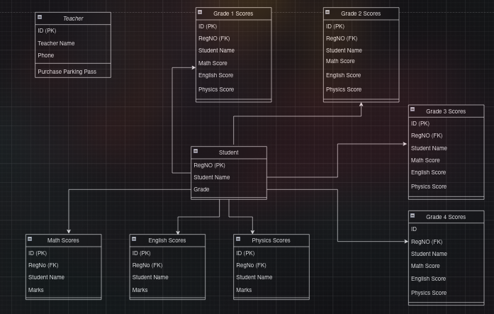

# 🌐 SCHOOL MANAGEMENT SYSTEM

- A database for a school.

- It stores information for:
    - Students
    - Teachers

- There's a table for each subject and each grade.

# 👀 Preview

- Here's an ERD Diagram for the system.

# ✅ Installation

- Clone this repo

`git clone https://github.com/bit-worm/plp-database-final-assignment.git`

- Navigate to the directory

`cd plp-database-final-assignment`

- Import the file to your database

`mysql -u username -p database-name < index.sql`

_replace the username and database-name_
